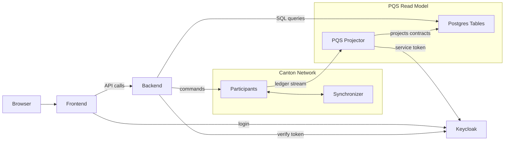

```mermaid
flowchart LR
  browser["Browser"]
  ui["Frontend"]
  backend["Backend"]
  auth["Keycloak"]

  subgraph canton["Canton Network"]
    participants["Participants"]
    synchronizer["Synchronizer"]
  end

  subgraph readModel["PQS Read Model"]
    pqs["PQS Projector"]
    postgres["Postgres Tables"]
  end

  browser --> ui
  ui -->|"login"| auth
  ui -->|"API calls"| backend

  backend -->|"verify token"| auth
  backend -->|"commands"| participants
  backend -->|"SQL queries"| postgres

  participants <--> synchronizer
  participants -->|"ledger stream"| pqs
  pqs -->|"projects contracts"| postgres

  pqs -->|"service token"| auth
```